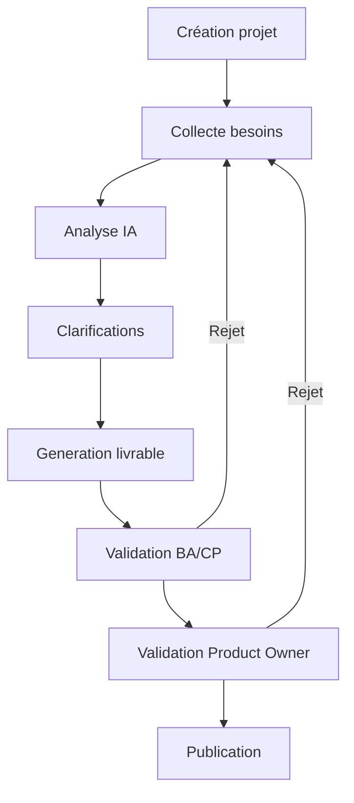
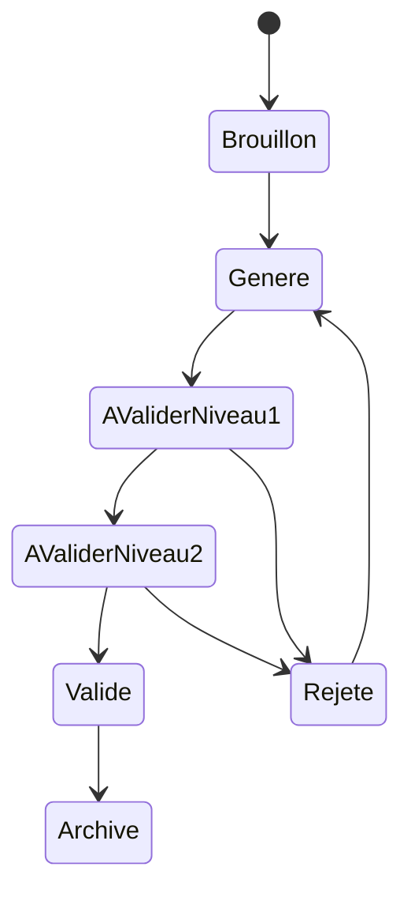
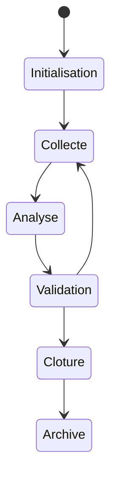

# Spécification Fonctionnelle (SFD)

## 1. Vision et objectifs du système

La plateforme a pour objectif de standardiser et industrialiser les activités de cadrage projet grâce à des agents IA capables d’assister les équipes dans la collecte, l’analyse, la structuration et la formalisation des besoins métier et fonctionnels.

Le système vise à :

- réduire de 40 à 50 % le temps consacré au cadrage ;
- améliorer la qualité, la cohérence et l’homogénéité des livrables ;
- détecter automatiquement les ambiguïtés, contradictions et informations manquantes ;
- fournir une traçabilité complète des décisions, validations et modifications ;
- maintenir un contrôle humain obligatoire avant toute diffusion officielle.

Le produit est conçu comme une plateforme SaaS multi-tenant extensible vers des déploiements mono-tenant ou on-premise.

## 2. Périmètre fonctionnel

### 2.1 Inclus dans le MVP

- Gestion multi-tenant des organisations.
- Gestion des utilisateurs et rôles.
- Création et gestion de projets de cadrage.
- Collecte structurée des besoins.
- Assistance IA conversationnelle.
- Analyse IA des incohérences et informations manquantes.
- Génération automatique des livrables de cadrage.
- Workflow configurable de validation humaine.
- Historisation des versions et validations.
- Audit et traçabilité.
- Gestion des risques, hypothèses et dépendances.
- Export des livrables en PDF, DOCX, XLSX et Markdown.
- Tableaux de bord et synthèses.
- Déploiement cloud ou on-premise.

### 2.2 Exclus du MVP

- Gestion opérationnelle des développements.
- Planification projet avancée.
- Estimation budgétaire.
- Génération de dossiers d’architecture détaillés.
- Intégrations temps réel avec Jira, Confluence ou Teams.
- Pilotage agile complet.

## 3. Personas et rôles utilisateurs

| Rôle | Description | Permissions |
|---|---|---|
| Administrateur plateforme | Gère tenants, sécurité et configuration globale | Administration complète |
| Administrateur organisation | Gère utilisateurs et paramètres d’une organisation | Gestion utilisateurs et projets |
| Chef de projet | Pilote le cadrage | Création projet, génération, validation |
| Business Analyst | Structure et affine les besoins | Saisie, édition, analyse IA |
| Product Owner | Valide les livrables finaux | Validation finale, arbitrage |
| Responsable métier | Fournit et relit les besoins | Consultation, commentaires |
| Direction | Consulte synthèses et indicateurs | Lecture seule |

## 4. Cas d’utilisation détaillés

### UC-001 — Créer et configurer un projet de cadrage

#### Objectif
Créer un espace projet structuré et sécurisé.

#### Acteurs
Chef de projet, Business Analyst.

#### Préconditions
- Utilisateur authentifié.
- Organisation active.
- Permission CREATE_PROJECT accordée.

#### Parcours nominal
1. L’utilisateur clique sur « Nouveau projet ».
2. Le système affiche le formulaire de création.
3. L’utilisateur renseigne : nom, description, contexte, objectifs, parties prenantes.
4. Le système valide les champs obligatoires.
5. Le projet est créé avec statut « Initialisation ».
6. Le système initialise espaces documentaires, historique et paramètres de workflow.
7. Le système associe automatiquement le créateur au projet.

#### Parcours alternatifs
- Import d’un modèle projet prédéfini.
- Création avec workflow simplifié.

#### Cas d’erreur
- Nom déjà utilisé dans l’organisation.
- Champs obligatoires manquants.
- Accès refusé.

### UC-002 — Collecter et structurer les besoins projet

#### Objectif
Formaliser les besoins métier de manière homogène.

#### Parcours nominal
1. L’utilisateur ajoute un besoin.
2. Le système propose une structure guidée.
3. L’IA analyse le contenu.
4. Le système identifie ambiguïtés et manques.
5. L’IA génère des questions de clarification.
6. L’utilisateur complète ou modifie les informations.
7. Le système historise la modification.

#### Cas alternatifs
- Saisie libre.
- Import manuel de notes atelier.
- Ignorer une recommandation IA.

#### Cas d’erreur
- Session expirée.
- Fichier invalide.
- Contenu inexploitable.

### UC-003 — Détecter incohérences et informations manquantes via IA

#### Parcours nominal
1. L’utilisateur lance une analyse.
2. Le moteur IA agrège les données projet.
3. Le système détecte incohérences et zones incomplètes.
4. Les anomalies sont catégorisées.
5. Le système génère des suggestions.
6. L’utilisateur traite les alertes.

#### Cas d’erreur
- Indisponibilité fournisseur IA.
- Temps de traitement dépassé.

### UC-004 — Générer automatiquement des livrables de cadrage

#### Livrables générables

- Expression du besoin
- Project Charter
- Cahier des charges fonctionnel
- Backlog initial
- Personas
- BPMN simplifié
- Matrice des parties prenantes
- Priorisation MoSCoW
- Registre risques/hypothèses/dépendances
- Comptes rendus d’ateliers

#### Parcours nominal
1. L’utilisateur sélectionne un type de livrable.
2. Le système vérifie les prérequis.
3. Le moteur IA agrège les données.
4. Le système génère un brouillon.
5. Une version est créée.
6. Le workflow de validation démarre.
7. Les validateurs sont notifiés.

#### Cas alternatifs
- Régénération d’une version.
- Génération partielle.

#### Cas d’erreur
- Données insuffisantes.
- Échec IA.
- Dépassement taille document.

### UC-005 — Valider humainement un livrable généré

#### Parcours nominal
1. Le Business Analyst ou Chef de projet relit le document.
2. Le validateur ajoute commentaires et corrections.
3. Le validateur approuve ou rejette.
4. Si approuvé, le document passe à l’étape suivante.
5. Le Product Owner effectue la validation finale.
6. Le système historise les validations.
7. Le document devient diffusable.

#### Cas alternatifs
- Validation simplifiée à un seul niveau.
- Rejet avec régénération.
- Validation conditionnelle.

#### Cas d’erreur
- Tentative de validation sans habilitation.
- Conflit de version.

### UC-006 — Gérer versions et historique des modifications

#### Parcours nominal
1. Une modification est enregistrée.
2. Le système crée une nouvelle version.
3. Les différences sont historisées.
4. Les utilisateurs autorisés consultent l’historique.

### UC-007 — Gérer rôles et habilitations

#### Parcours nominal
1. L’administrateur crée un utilisateur.
2. Il affecte un rôle.
3. Le système applique les permissions.
4. Les accès sont journalisés.

### UC-008 — Consulter tableaux de bord et synthèses

#### Parcours nominal
1. L’utilisateur ouvre un tableau de bord.
2. Le système affiche indicateurs projet.
3. Les données sont filtrables.

### UC-009 — Exporter un livrable validé

#### Parcours nominal
1. L’utilisateur sélectionne un livrable validé.
2. Il choisit un format d’export.
3. Le système génère le fichier.
4. Le fichier est téléchargé.

#### Formats supportés
- PDF
- DOCX
- XLSX
- Markdown

### UC-010 — Administrer les modèles IA et paramètres système

#### Parcours nominal
1. L’administrateur configure un fournisseur IA.
2. Le système valide la connectivité.
3. Les paramètres sont sauvegardés.
4. Le fournisseur devient disponible.

## 5. User Stories

- En tant que chef de projet, je veux centraliser les besoins afin de réduire la dispersion documentaire.
- En tant que Business Analyst, je veux recevoir des suggestions IA afin d’améliorer la qualité des besoins.
- En tant que Product Owner, je veux valider les livrables avant diffusion afin de garantir leur conformité.
- En tant qu’équipe technique, je veux exploiter des livrables homogènes afin de limiter les demandes de clarification.
- En tant qu’administrateur, je veux isoler les données par organisation afin de garantir la confidentialité.

## 6. Règles de gestion

| ID | Règle |
|---|---|
| RG-001 | Tout livrable généré par IA doit être validé avant diffusion. |
| RG-002 | Chaque modification crée une nouvelle version historisée. |
| RG-003 | Les actions IA et humaines doivent être tracées. |
| RG-004 | Les données doivent être isolées par organisation. |
| RG-005 | Les workflows de validation sont configurables. |
| RG-006 | Une validation finale Product Owner est requise par défaut. |
| RG-007 | Les documents rejetés ne sont pas exportables. |
| RG-008 | Les exports sont autorisés uniquement pour les documents validés. |
| RG-009 | Les documents supérieurs à 100 Mo doivent être refusés. |
| RG-010 | Les alertes IA doivent être catégorisées par criticité. |

## 7. Parcours utilisateurs et workflows



## 8. États et transitions des entités métier

### État d’un livrable



### État d’un projet



## 9. Critères d’acceptation

### UC-001

```text
Given un utilisateur habilité
When il crée un projet avec tous les champs obligatoires
Then le projet est créé avec statut « Initialisation »
```

### UC-003

```text
Given un projet contenant des besoins contradictoires
When l’utilisateur lance une analyse IA
Then le système génère au moins une alerte critique
```

### UC-004

```text
Given un projet contenant des besoins validés
When l’utilisateur génère un cahier des charges fonctionnel
Then le système crée un brouillon versionné avec statut « À valider »
```

### UC-005

```text
Given un livrable au statut « À valider niveau 2 »
When le Product Owner approuve le document
Then le statut devient « Validé » et le document devient exportable
```

### UC-009

```text
Given un document validé
When l’utilisateur choisit le format PDF
Then le système génère un fichier téléchargeable
```

## 10. Gestion des erreurs, cas limites et comportements exceptionnels

- Gestion des conflits de modification simultanée.
- Blocage des exports pour documents non validés.
- Gestion de l’indisponibilité temporaire d’un fournisseur IA.
- Journalisation des erreurs techniques et IA.
- Détection des documents corrompus.
- Gestion des quotas organisationnels.
- Reprise automatique des tâches asynchrones interrompues.
- Timeout configurable des générations IA.
- Notification des échecs de validation.
- Isolation stricte des données entre tenants.
- Vérification antivirus des fichiers importés.