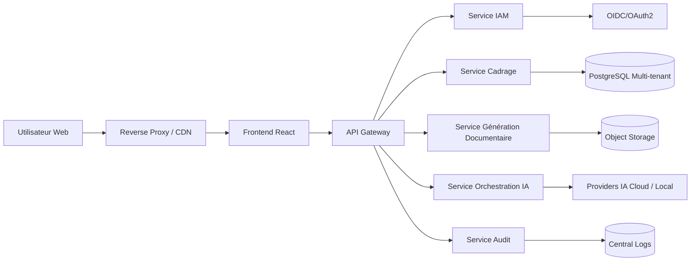
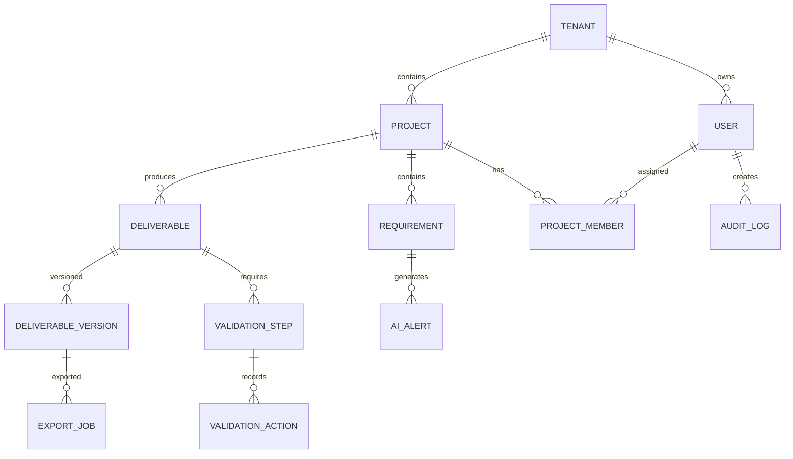

# Spécification Technique (STD)

## 1. Architecture globale



### Principes d’architecture

- Architecture modulaire orientée services.
- Multi-tenant natif.
- Compatibilité cloud et on-premise.
- Isolation logique et sécurisée des tenants.
- Génération documentaire asynchrone.
- Fournisseurs IA interchangeables.

## 2. Choix technologiques recommandés et justification

| Domaine | Technologie | Justification |
|---|---|---|
| Frontend | React + TypeScript | Productivité et maintenabilité |
| Backend | NestJS | Modularité et robustesse API |
| Base de données | PostgreSQL | Transactions, sécurité, scalabilité |
| Cache | Redis | Gestion sessions et jobs |
| Queue | RabbitMQ | Traitements asynchrones |
| Stockage documentaire | S3 compatible | Gestion objets volumineux |
| IAM | Keycloak ou Auth0 | Support OIDC multi-tenant |
| IA | LangChain / orchestration provider-agnostic | Abstraction fournisseurs IA |
| Déploiement | Docker + Kubernetes | Portabilité cloud/on-premise |
| Monitoring | Prometheus + Grafana | Observabilité |
| Logs | ELK / OpenSearch | Audit et recherche |

## 3. Découpage en modules / services

| Module | Responsabilité |
|---|---|
| IAM | Authentification, RBAC, SSO |
| Tenant Management | Gestion organisations et isolation |
| Project Service | Gestion projets |
| Requirement Service | Gestion besoins |
| AI Orchestrator | Analyse, reformulation, génération |
| Validation Service | Workflow configurable |
| Document Service | Génération export et versioning |
| Notification Service | Emails et alertes |
| Audit Service | Historisation et traçabilité |
| Reporting Service | KPIs et tableaux de bord |

## 4. Modèle de données



### Entité TENANT

| Champ | Type | Contraintes |
|---|---|---|
| id | UUID | PK |
| name | VARCHAR(255) | Unique |
| mode | ENUM | SaaS, MonoTenant, OnPrem |
| created_at | TIMESTAMP | Obligatoire |

### Entité USER

| Champ | Type | Contraintes |
|---|---|---|
| id | UUID | PK |
| tenant_id | UUID | FK |
| email | VARCHAR(255) | Unique par tenant |
| role | VARCHAR(50) | Obligatoire |
| status | VARCHAR(50) | Obligatoire |

### Entité PROJECT

| Champ | Type | Contraintes |
|---|---|---|
| id | UUID | PK |
| tenant_id | UUID | FK |
| name | VARCHAR(255) | Unique par tenant |
| status | VARCHAR(50) | Obligatoire |
| created_by | UUID | FK USER |
| created_at | TIMESTAMP | Obligatoire |

### Entité REQUIREMENT

| Champ | Type | Contraintes |
|---|---|---|
| id | UUID | PK |
| project_id | UUID | FK |
| title | VARCHAR(255) | Obligatoire |
| description | TEXT | Obligatoire |
| priority | ENUM | Must, Should, Could, Wont |
| ambiguity_score | INTEGER | 0-100 |
| status | VARCHAR(50) | Obligatoire |

### Entité DELIVERABLE

| Champ | Type | Contraintes |
|---|---|---|
| id | UUID | PK |
| project_id | UUID | FK |
| type | VARCHAR(100) | Obligatoire |
| status | VARCHAR(50) | Obligatoire |
| current_version_id | UUID | FK |

### Entité DELIVERABLE_VERSION

| Champ | Type | Contraintes |
|---|---|---|
| id | UUID | PK |
| deliverable_id | UUID | FK |
| version_number | INTEGER | Obligatoire |
| storage_path | TEXT | Obligatoire |
| generated_by_ai | BOOLEAN | Obligatoire |
| created_at | TIMESTAMP | Obligatoire |

### Entité VALIDATION_STEP

| Champ | Type | Contraintes |
|---|---|---|
| id | UUID | PK |
| deliverable_id | UUID | FK |
| level | INTEGER | Obligatoire |
| validator_role | VARCHAR(50) | Obligatoire |
| status | VARCHAR(50) | Obligatoire |

## 5. APIs

### POST /api/v1/projects

#### Requête

```json
{
  "name": "Projet CRM",
  "description": "Transformation CRM",
  "objectives": ["Améliorer la relation client"]
}
```

#### Réponse 201

```json
{
  "id": "uuid",
  "status": "INITIALISATION"
}
```

### POST /api/v1/projects/{id}/requirements

#### Requête

```json
{
  "title": "Gestion utilisateurs",
  "description": "Le système doit permettre la gestion RBAC",
  "priority": "must"
}
```

### POST /api/v1/projects/{id}/analysis

#### Réponse 202

```json
{
  "jobId": "uuid",
  "status": "processing"
}
```

### POST /api/v1/projects/{id}/deliverables/generate

#### Requête

```json
{
  "type": "functional_specification"
}
```

### POST /api/v1/deliverables/{id}/validate

#### Requête

```json
{
  "decision": "approved",
  "comment": "Conforme"
}
```

### GET /api/v1/deliverables/{id}/export?format=pdf

#### Réponse 200

Fichier binaire téléchargeable.

### Codes de réponse standards

| Code | Signification |
|---|---|
| 200 | Succès |
| 201 | Créé |
| 202 | Traitement asynchrone |
| 400 | Requête invalide |
| 401 | Non authentifié |
| 403 | Accès refusé |
| 404 | Ressource introuvable |
| 409 | Conflit version |
| 422 | Données inexploitables |
| 500 | Erreur interne |

## 6. Intégrations avec les systèmes externes

### MVP

| Système | Usage |
|---|---|
| OpenAI / Azure OpenAI | Génération IA |
| Anthropic | Génération IA alternative |
| Google Gemini | Génération IA alternative |
| SMTP | Notifications |
| OIDC Provider | Authentification |
| S3 Storage | Stockage documentaire |

### Extensions futures

- Jira
- Confluence
- Microsoft Teams
- SharePoint
- Git

## 7. Authentification et gestion des autorisations

### Authentification

- OIDC/OAuth2.
- MFA configurable.
- Sessions JWT avec expiration.
- Support SSO entreprise.

### Autorisations

- RBAC par organisation et projet.
- Permissions granulaires.
- Isolation stricte tenant.
- Contrôle des exports.

## 8. Sécurité

### Protection des données

- TLS 1.2+ obligatoire.
- AES-256 au repos.
- Rotation des secrets.
- Chiffrement stockage objet.

### Sécurité applicative

- Validation stricte des entrées.
- Protection OWASP Top 10.
- Protection XSS, CSRF, SQL Injection.
- Scan antivirus des imports.
- Limitation débit API.

### Sécurité IA

- Journalisation prompts/réponses.
- Filtrage données sensibles.
- Cloisonnement par tenant.
- Désactivation configurable des fournisseurs externes.

### Conformité

- RGPD.
- Journal d’audit.
- Suppression logique.
- Politique de rétention configurable.

## 9. Déploiement et infrastructure

### Modes supportés

| Mode | Description |
|---|---|
| SaaS multi-tenant | Plateforme mutualisée |
| Mono-tenant cloud | Instance dédiée |
| On-premise | Déploiement Kubernetes client |

### Infrastructure minimale MVP

- 2 nœuds applicatifs.
- PostgreSQL haute disponibilité.
- Redis.
- RabbitMQ.
- Object storage.
- Reverse proxy.
- Stack monitoring.

### CI/CD

- Build Docker automatisé.
- Tests automatiques.
- Analyse sécurité.
- Déploiement GitOps.

## 10. Exigences de performance, scalabilité et monitoring

### Capacités cibles MVP

| Exigence | Valeur |
|---|---|
| Utilisateurs enregistrés | 500 par organisation |
| Utilisateurs simultanés | 100 |
| Disponibilité | 99,5 % |
| Taille document | 100 Mo maximum |
| Temps génération livrable | < 2 minutes |
| Temps réponse UI | < 3 secondes hors IA |

### Scalabilité

- Horizontal scaling Kubernetes.
- Workers IA indépendants.
- Queue asynchrone.
- Cache Redis.

### Monitoring

- Logs centralisés.
- KPIs applicatifs.
- Monitoring IA.
- Alertes disponibilité.
- Audit sécurité.
- Traces distribuées.

### Sauvegarde et reprise

- Sauvegarde quotidienne.
- Rétention configurable.
- PRA documenté.
- Tests de restauration réguliers.